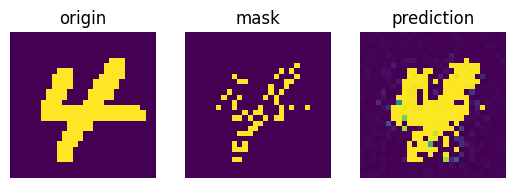
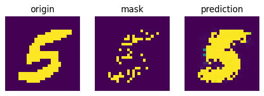
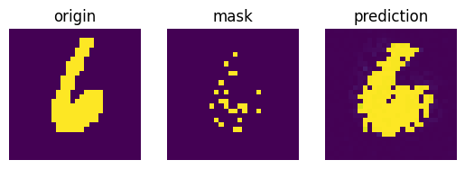

[//]: # (# satnet-rules)

[//]: # (Explore the rule learning capability of SatNet on CV tasks.)

[//]: # ()
[//]: # (Reconstruction of MNIST images:)

[//]: # ()
[//]: # (<table>)

[//]: # (  <tr>)

[//]: # (    <td>)

[//]: # (      )

[//]: # (    </td>)

[//]: # (    <td>)

[//]: # (      )

[//]: # (    </td>)

[//]: # (  </tr>)

[//]: # (  <tr>)

[//]: # (    <td>)

[//]: # (      )

[//]: # (    </td>)

[//]: # (    <td>)

[//]: # (      )

[//]: # (    </td>)

[//]: # (  </tr>)

[//]: # (  <tr>)

[//]: # (    <td>)

[//]: # (      )

[//]: # (    </td>)

[//]: # (    <td>)

[//]: # (      )

[//]: # (    </td>)

[//]: # (  </tr>)

[//]: # (  <tr>)

[//]: # (    <td>)

[//]: # (      )

[//]: # (    </td>)

[//]: # (    <td>)

[//]: # (      )

[//]: # (    </td>)

[//]: # (  </tr>)

[//]: # (  <tr>)

[//]: # (    <td>)

[//]: # (      )

[//]: # (    </td>)

[//]: # (    <td>)

[//]: # (      )

[//]: # (    </td>)

[//]: # (  </tr>)

[//]: # (</table>)

# MixNet

## forward
for each $i\in IN$
-    $v_i=-cos(\pi z_i)v_T+sin(\pi z_i)(I_k-V_TV_T^T)v_i^{rand}$

for each $o\in OUT$
-    $g_o=\sum_j c_{oj}v_j$
-    $v_o=-g_o/||g_o||$

repeat until convergence.

sample $z_o\sim P(z_o=1)=cos^{-1}(-v_i^Tv_T)/\pi$.

## backward
for each $o$ $\in$ $OUT$
-    $g_o=\sum_j c_{oj}v_j$
-    $P_o=I_k-v_ov_o^T$
-    $\frac{\partial l}{\partial v_o}=\frac{\partial l}{\partial z_o}\frac{\partial z_o}{\partial v_o}=\frac{\partial l}{\partial z_o}\frac{V_T}{\epsilon+\pi sin(\pi z_o)}$
-    $u_o=\frac{1}{||g_o||}P_o(\frac{\partial l}{\partial v_o}-\sum_{j\in out}c_{oj}u_j)$

repeat until convergence.

$\frac{\partial l}{\partial c_{oj}}=\frac{\partial l}{\partial c_{oj}}+\frac{\partial l}{\partial c_{jo}}\frac{\partial c_{jo}}{\partial c_{oj}}=-u_o^Tv_j-u_j^Tv_o$  $(o \neq j)$ 

$\frac{\partial l}{\partial c_{ii}}=0$

$\frac{\partial l}{\partial v_j}=-\sum_{o\in out}u_o c_{oj}$

$\frac{\partial v_j}{\partial z_j}=\pi(sin(\pi z_j)v_T+cos(\pi z_j)(I_k-v_Tv^T_T)v_j^{rand})$

$\frac{\partial l}{\partial z_j}=\frac{\partial l}{\partial z^*_j} - (\frac{\partial v_j}{\partial z_j})^T\frac{\partial l}{\partial v_j}$

run the example code:
```
python setup_mixnet.py install && python mixnet/models_cpp.py
```
